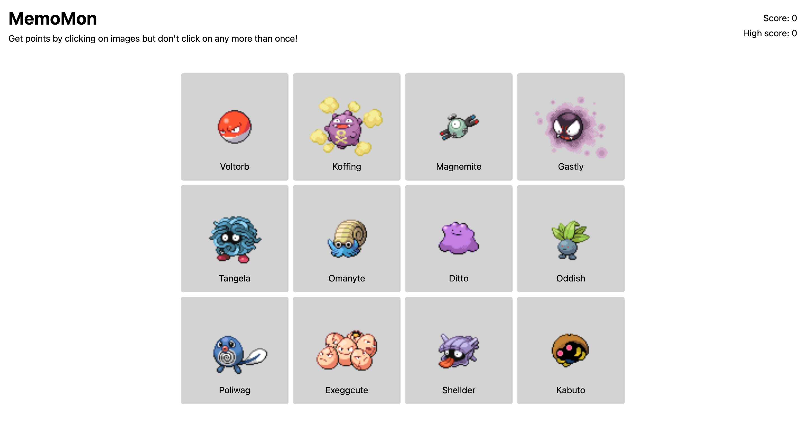

# MemoMon

My implementation of the [memory card project](https://www.theodinproject.com/lessons/node-path-react-new-memory-card) for [The Odin Project](https://www.theodinproject.com/). Check out the [live preview](https://memo-mon.netlify.app/)!

## Description

This is a memory card game, built using React. Users get points by clicking on Pokémon images but they lose if they click the same one twice. I set up the application using [Vite](https://vitejs.dev/) and deployed it using [Netlify](https://www.netlify.com/).

## Features

- Card tilt effect on mouse hover
- Fetches Pokémon data from PokéAPI
- Locally caches resources after requesting them from the API
- Keeps track of current score and high score
- Randomizes card order after user selects a card

## What I learned

- How to fetch data from an external API using `useEffect`

## Acknowledgements

- Pokémon data from [PokéAPI](https://pokeapi.co/)
- [Pokéball favicon](https://slackmojis.com/emojis/60591-pokeball) from [Slackmojis](https://slackmojis.com/)
- Card tilt effect from [React Parallax Tilt](https://github.com/mkosir/react-parallax-tilt)
